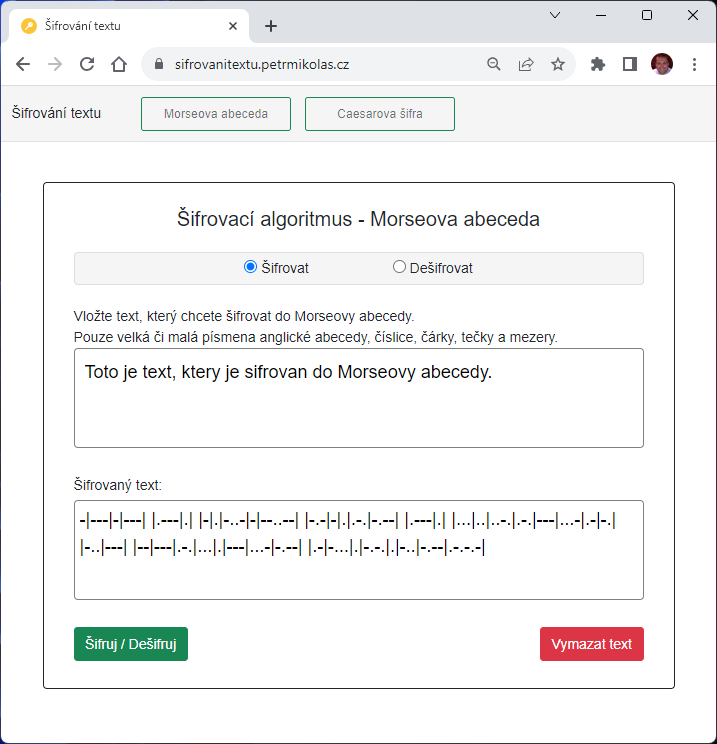
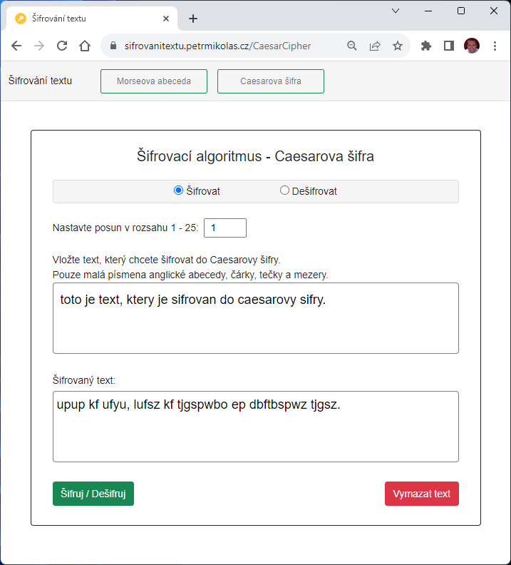
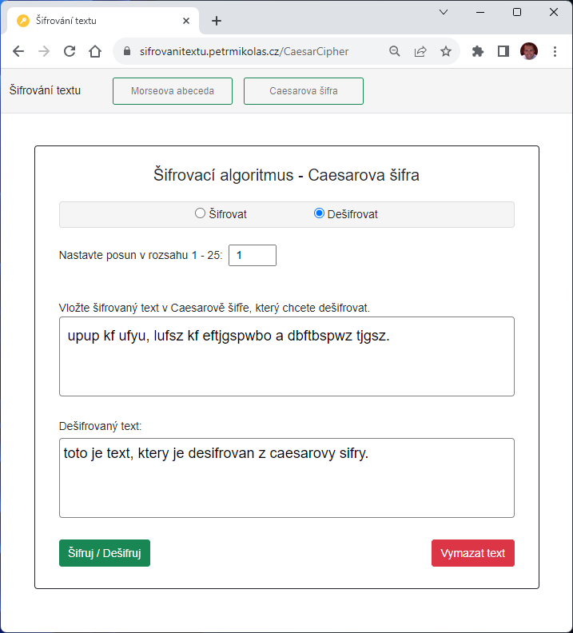

# Šifrování textu
Webová aplikace na šifrování a dešifrovaní textu. 

Naprogramováno v jazyce C# v prostředí Microsoft .NET 7

- App - ASP.NET Core (MVC)
- Unit testy - NUnit
- Nasazení - Docker kontejner pomocí Docker Compose

